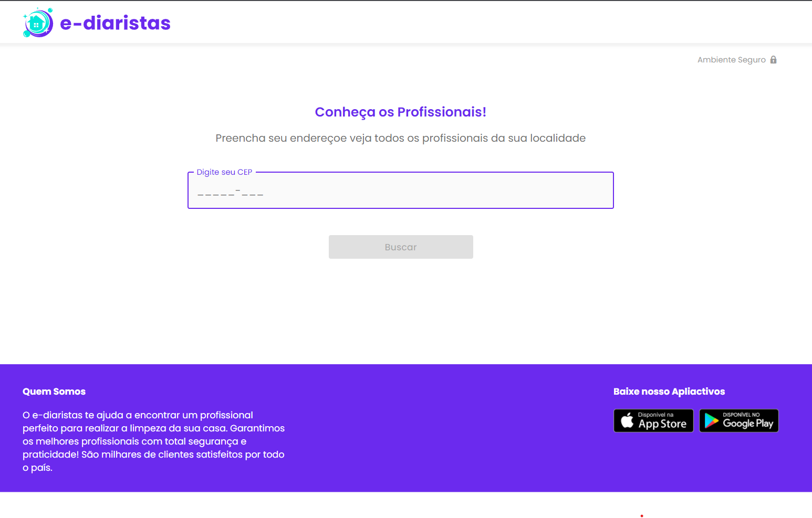

# Frontend E-Diaristas

Projeto de Frontend desenvolvido durante a imersão Multi Stack da [TreinaWeb](http://treinaweb.com.br/) utilizando TypeScript, React e Next.js.



## Dependências do Projeto

- React
- Styled
- Material
- Axios
- Next

## Dependências de Desenvolvimento

- TypeScript
- Eslint

## Requisitos

- Node

## Executando na máquina local?

Clone este repositório e entre na pasta do projeto.

```sh
git clone https://github.com/junieldantas/ediaristas-frontend-react-next.git
cd ediaristas-frontend-react-next
```

Execute o projeto através do Npm.

```sh
npm run dev
```

Acesse a aplicação em [http://localhost:3000/](http://localhost:3000/).
